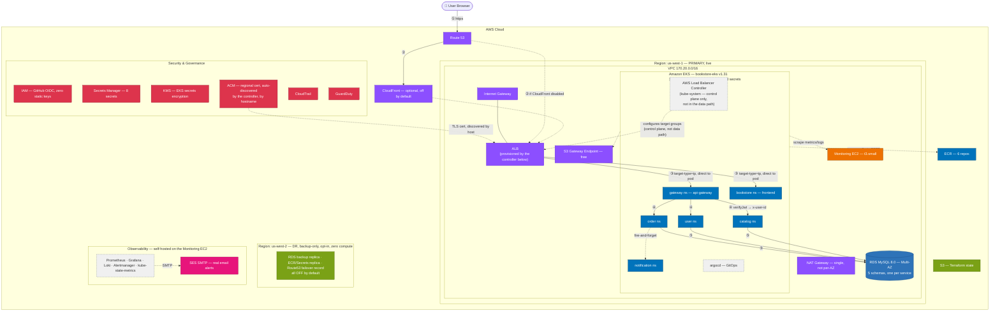

# AWS Architecture

Official-AWS-style diagram, rendered inline with Mermaid (no external tool needed — GitHub/GitLab/VS Code preview all render this natively). Verified against the live Terraform/Kubernetes source as of 2026-08-15. Region `us-west-1` is primary and holds every live workload; `us-west-2` is backup-replication-only, opt-in, zero compute.



## Legend

| Color | Category |
|---|---|
| 🟧 Orange | Compute |
| 🟦 Blue (dark) | Containers |
| 🔵 Blue (medium) | Database |
| 🟣 Purple | Networking & Content Delivery |
| 🔴 Red | Security, Identity & Compliance |
| 🟩 Green | Storage |
| 🩷 Pink | Management & Governance |
| ⬜ Grey, dashed | Third-party / self-hosted — **not** an AWS-managed service |

Solid arrows = synchronous request path (numbered ①–⑤, the flow a real API call takes). Dashed arrows = async/background/control-plane-only (image pulls, metric scrapes, email delivery, fire-and-forget notification, the load balancer controller configuring the ALB).

---

## Boundary nesting (outermost → innermost)

```
AWS Cloud
└── Region: us-west-1 (primary)
    └── VPC 170.20.0.0/16 — 1× Internet Gateway, attached at VPC level (not per-AZ)
        ├── AZ us-west-1a — public subnet (ALB, Monitoring EC2) · private EKS subnets ×2 · private RDS subnet (primary)
        └── AZ us-west-1c — public subnet (NAT Gateway) · private EKS subnets ×2 · private RDS subnet (standby)
└── Region: us-west-2 (DR — backup-only, opt-in, nothing to fail over to yet)
```

## Primary request flow (numbered arrows above)

1. Browser → Route 53
2. Route 53 → (CloudFront, if enabled) → ALB
3. ALB → directly to the target pod (`target-type: ip`) — `frontend` for static assets, `api-gateway` for every API call. **No in-cluster ingress-controller hop** — the AWS Load Balancer Controller only configures the ALB's target groups from outside the data path, it doesn't sit in it the way ingress-nginx used to.
4. `api-gateway` verifies the JWT, injects `x-user-id`, proxies to the owning microservice
5. Microservice → RDS, its own schema, reachable only from the EKS-node subnets

## Get these right

- **ALB, via the AWS Load Balancer Controller** — not ingress-nginx (officially retired by the Kubernetes project 2026-03-31, replaced 2026-08-15, see `docs/TROUBLESHOOTING.md` OBS-057), not a Classic ELB (what this project actually ran for most of its history despite older docs calling it "NLB"), and not an NLB either (planned as the fix at one point, superseded before ever being applied once ingress-nginx's retirement became the real, dominant issue). TLS terminates at the ALB using an ACM certificate the controller auto-discovers by hostname — no cert-manager anymore, it had no other consumer once ingress TLS moved off it.
- **CloudFront is off by default** — real Terraform, not deployed unless explicitly enabled.
- **NAT is single, not per-AZ** — a deliberate cost tradeoff. The S3 Gateway Endpoint (free) takes ECR/S3 traffic off it to cut data-processing cost, but doesn't touch the availability gap.
- **DR is opt-in plumbing, not a standby environment** — two separate Terraform flags gate it, both default `false`. No mirrored EKS cluster in `us-west-2`.
- **RDS is one Multi-AZ instance with 5 schemas**, not five instances — isolation is schema + user level, not instance level.
- **The old monolith backend is gone** — every frontend call goes through `api-gateway`; there is no `frontend → backend` line anymore.
- **The monitoring stack is not inside EKS** — Prometheus/Grafana/Loki/Alertmanager run via Docker Compose on a separate EC2; the cluster runs zero monitoring pods.

## Related

- [`UML.md`](UML.md) — application-layer diagrams (services, data model, request sequences)
- [`CICD_DIAGRAM_PROMPT.md`](CICD_DIAGRAM_PROMPT.md) — CI/CD pipeline diagram
- [`ARCHITECTURE.md`](ARCHITECTURE.md) — full narrative writeup
- [`TERRAFORM.md`](TERRAFORM.md) — every module in depth
