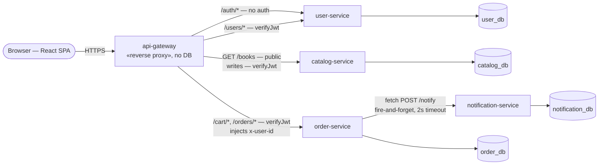
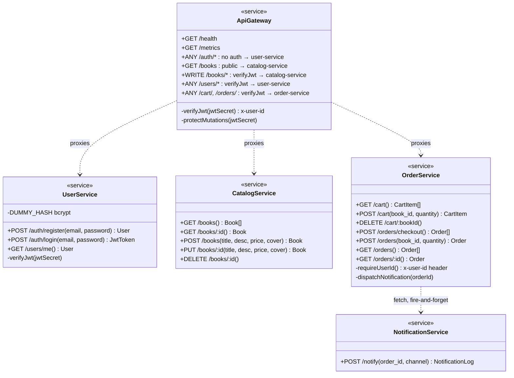
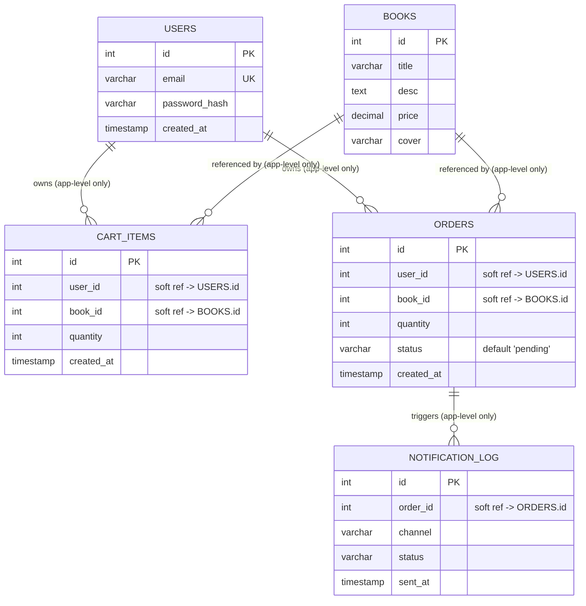
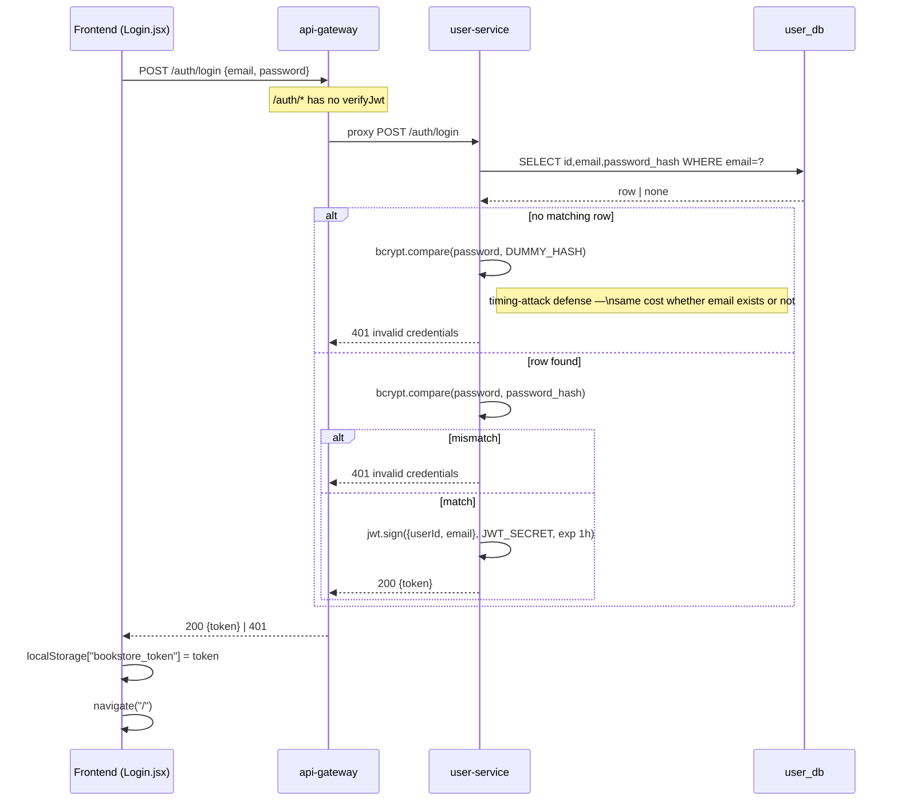
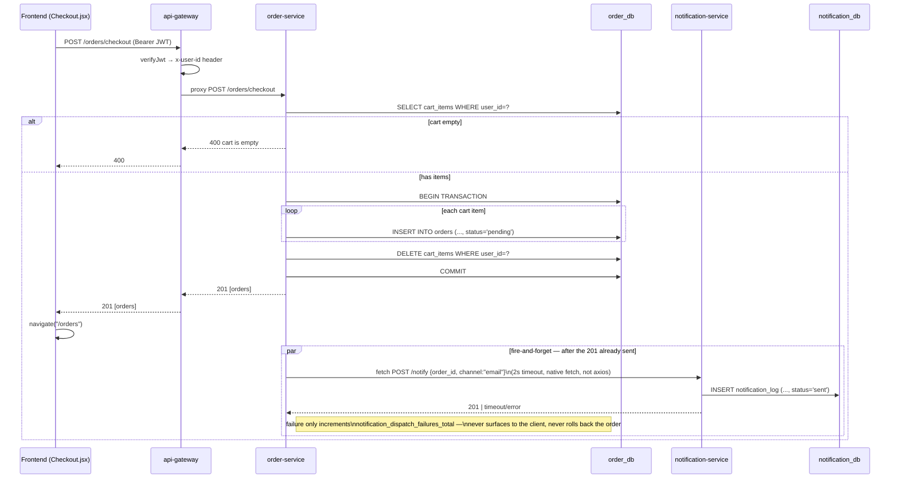
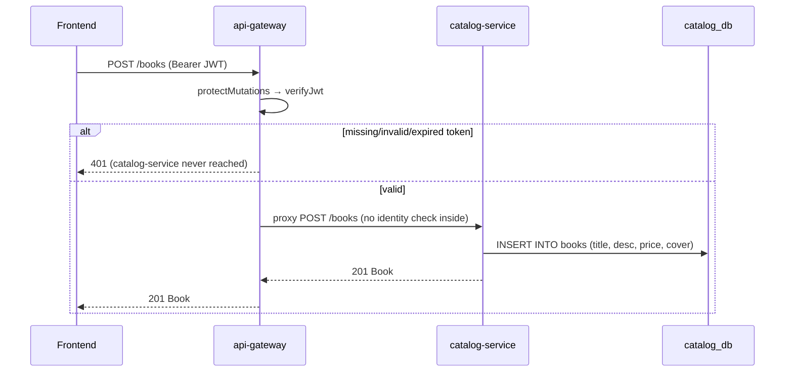
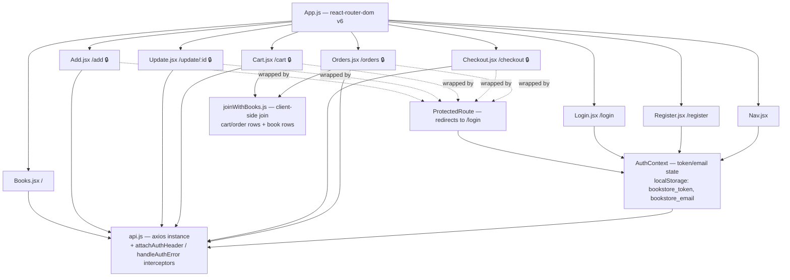

# Application UML

UML of the **application layer** only (not infrastructure — see `ARCHITECTURE_DIAGRAM_PROMPT.md`/`CICD_DIAGRAM_PROMPT.md` for that). Rendered with Mermaid, native in this file on GitHub/GitLab/most Markdown viewers. Verified against real source as of 2026-08-14: `services/{api-gateway,catalog-service,user-service,order-service,notification-service}` (flat single-file Express apps — one `app.js` factory + `index.js` entrypoint each, no `routes/`/`controllers/`/`models/` subdirs, no ORM, raw `mysql2` SQL) and `client/src/` (React, react-router-dom v6).

---

## 1. Component diagram — services

**Only real inter-service call is `order-service → notification-service`.** `catalog-service` never talks to anyone; `order-service` never calls `catalog-service` (no server-side book/price validation — the `orders` table doesn't even store price). Every service exposes `GET /health` and `GET /metrics` (prom-client) — omitted above for clarity.

---

## 2. Class diagram — service interfaces

Not object classes (there are none — every service is stateless functions over `mysql2` pools). This models each service as its public HTTP interface, `«service»` stereotype, methods = routes.

**JWT is verified in exactly two places**: `ApiGateway.verifyJwt` (every proxied call) and `UserService.verifyJwt` on `GET /users/me` only (redundant, self-contained re-check). `CatalogService`, `OrderService`, and `NotificationService` never verify a token themselves — `OrderService` trusts the `x-user-id` header the gateway injects; `CatalogService` has zero identity awareness at all, relying entirely on the gateway to gate writes.

---

## 3. Entity-relationship diagram — data model

Four **separate physical databases** (`catalog_db`, `user_db`, `order_db`, `notification_db`), one per service, on the same shared RDS instance. No SQL `FOREIGN KEY` constraints exist anywhere — `user_id`/`book_id`/`order_id` are plain `INT` columns, cross-database references enforced only in application code. Relationships below are logical, not physical.

`CART_ITEMS` has a real DB-level constraint worth noting even though it's not a FK: `UNIQUE(user_id, book_id)`, which is what makes `POST /cart`'s `INSERT ... ON DUPLICATE KEY UPDATE quantity=?` behave as an upsert. `ORDERS` doesn't store `price` — the checkout flow never looks it up, so an order's value can only be reconstructed by joining back to `BOOKS.price` at read time (which is exactly what the frontend's `joinWithBooks.js` does).

---

## 4. Sequence — register &amp; login

---

## 5. Sequence — checkout

`order-service` never calls `catalog-service` in this flow — no server-side price/stock validation happens anywhere in checkout.

---

## 6. Sequence — authenticated write (identity boundary)

Shows why `catalog-service` needs zero code changes to stay secure: the gateway is the entire enforcement point.

---

## 7. Frontend component diagram

`🔒` = wrapped in `ProtectedRoute`, redirects to `/login` client-side if `AuthContext.isAuthenticated` is false — this is UX only, not a security boundary; the real boundary is `api-gateway`'s `verifyJwt`.

---

## Facts worth remembering when reading these diagrams

- **No ORM anywhere.** Every service uses raw SQL via `mysql2` (callback-style, except `order-service`'s checkout endpoint, which uses `.promise()` for the transaction). No Sequelize/TypeORM/Prisma.
- **No `axios` in any backend service.** `order-service → notification-service` uses native `fetch` with `AbortSignal.timeout(2000)`. `axios` is frontend-only.
- **JWT claims are minimal:** `{ userId, email, iat, exp }`, HS256, 1h expiry. `JWT_SECRET` is shared between `user-service` (sign + verify) and `api-gateway` (verify only), via a Kubernetes `ExternalSecret` synced from AWS Secrets Manager.
- **`api-gateway` deliberately has no `express.json()`** — parsing the body would consume the stream `http-proxy-middleware` needs to forward it untouched.
- **Registration does not log the user in** — `POST /auth/register` returns `{id, email}`, no token; the frontend redirects to `/login` afterward.
- **The alternate `POST /orders` endpoint (single-item, bypasses cart) exists in `order-service` but no frontend page calls it** — dead code from the UI's perspective, still live and reachable via the gateway.
- **Test runner is `vitest` + `supertest`** in every service (not `jest`, despite `jest`-style syntax being common elsewhere in the JS ecosystem).

## Related

- [`ARCHITECTURE.md`](ARCHITECTURE.md) — narrative infra + app overview
- [`ARCHITECTURE_DIAGRAM_PROMPT.md`](ARCHITECTURE_DIAGRAM_PROMPT.md) — AWS infrastructure diagram prompt
- [`CICD_DIAGRAM_PROMPT.md`](CICD_DIAGRAM_PROMPT.md) — CI/CD pipeline diagram prompt
- [`KUBERNETES.md`](KUBERNETES.md) — how these services are deployed and networked
