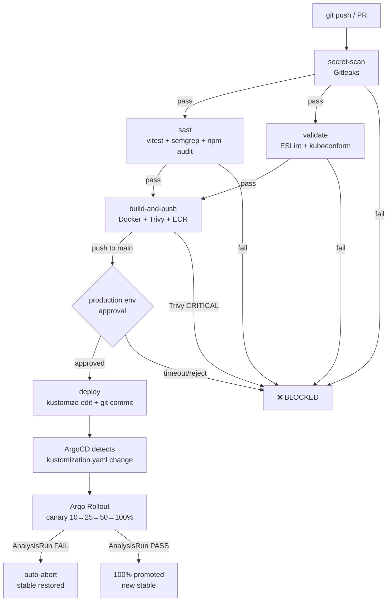
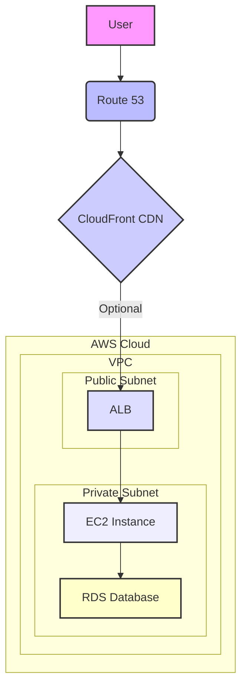

# Architecture & CI/CD Diagram Prompts

Prompts for generating visual diagrams of the Bookstore Phase 2 infrastructure.
Use with AI diagram tools (Eraser.io, Napkin.ai, ChatGPT, Claude) or diagram-as-code tools (draw.io, Mermaid, Lucidchart, PlantUML).

---

## Diagram 1 — Full System Architecture (Primary Region)

### Prompt

> Create a detailed AWS architecture diagram for a three-tier bookstore web application deployed on EKS in us-west-1 (N. California).
>
> **Layout (top to bottom, left to right):**
>
> **TOP LAYER — External / Internet**
> - User browser on the left
> - Arrow from browser to Route53 (DNS with active/passive health-check failover routing)
> - Optional CloudFront CDN in front of Route53 (marked as "optional, enable_cloudfront=true")
> - Domain registrar NS records point to Route53 public zone (b17facebook.xyz)
>
> **LAYER 2 — AWS Account boundary box (us-west-1 N. California)**
>
> Inside the account, show a VPC box (170.20.0.0/16) containing:
>
> **Public Subnets (170.20.1.0/24 us-west-1a, 170.20.2.0/24 us-west-1c)**
> - Internet Gateway (attached to VPC)
> - Single NAT Gateway in us-west-1a (with note: "single NAT = cost-optimised, HA upgrade: one NAT per AZ")
> - AWS Network Load Balancer (NLB) provisioned by ingress-nginx controller
>
> **Private Subnets — EKS Node Group (170.20.3–6.0/24, across 2 AZs)**
> Show a single EKS node (t3.medium) containing Kubernetes pods in separate coloured namespace boxes:
>
> - **bookstore namespace** (blue box):
>   - frontend pod (React app served via Nginx on port 8080, 2 replicas, HPA 2-3)
>   - backend pod (Node.js/Express on port 3000, Argo Rollout canary, HPA 1-5) with /metrics endpoint
>   - nginx-ingress pod routing: bookstore.b17facebook.xyz → frontend:8080, /api/* → backend:3000
>
> - **ingress-nginx namespace** (orange box):
>   - ingress-nginx controller pod
>   - Arrow: NLB → ingress-nginx → frontend/backend
>
> - **cert-manager namespace** (purple box):
>   - cert-manager controller
>   - ClusterIssuer (letsencrypt-prod, ACME HTTP-01)
>   - Arrow: cert-manager watches Ingress → requests LE cert → stores as k8s Secret
>
> - **external-secrets namespace** (yellow box):
>   - ESO controller
>   - ClusterSecretStore (IRSA role)
>   - Arrow: ESO → Secrets Manager /bookstore/db-credentials → k8s Secret "db-secret" → backend pod env vars
>
> - **monitoring namespace** (green box):
>   - Prometheus (scrapes backend /metrics via ServiceMonitor)
>   - Grafana (queries Prometheus + Loki, admin password from SM /bookstore/grafana-admin)
>   - Alertmanager
>   - Loki + Promtail DaemonSet (collects pod logs from all nodes)
>   - Arrow: Prometheus → feeds Argo Rollouts AnalysisTemplate (canary error rate check)
>
> - **argocd namespace** (teal box):
>   - ArgoCD server
>   - Arrow: ArgoCD polls GitHub repo every 3 min → applies k8s/overlays/prod/ → triggers Argo Rollout
>
> - **argo-rollouts namespace** (red box):
>   - Argo Rollouts controller
>   - Arrow: controls canary traffic split via nginx-ingress canary-weight annotation (10% → 25% → 50% → 100%)
>
> **Private Subnets — RDS (170.20.7.0/24 us-west-1a, 170.20.8.0/24 us-west-1c)**
> - RDS MySQL 8.0, db.t3.micro, Multi-AZ (primary in .7, standby in .8)
> - Arrow: backend pod → Security Group → RDS port 3306
> - Arrow from RDS: CloudWatch Logs (error/general/slowquery), Performance Insights, Enhanced Monitoring
>
> **LAYER 3 — AWS Managed Services (inside account, outside VPC)**
> - ECR (2 repos: bookstore-frontend, bookstore-backend) — Arrow: nodes pull images
> - Secrets Manager (/bookstore/db-credentials, /bookstore/grafana-admin) — Arrow: ESO pulls credentials
> - ACM Certificate (*.b17facebook.xyz) for us-west-1 ingress TLS
> - CloudTrail (multi-region, logs to encrypted S3 bucket)
> - GuardDuty (EKS audit + S3 + malware scan)
> - VPC Flow Logs → CloudWatch (90-day retention)
> - S3 bucket (Terraform remote state + DynamoDB lock table)
>
> **LAYER 4 — GitHub (external, top right)**
> - GitHub repo box with arrows:
>   - GitHub Actions CI → ECR (Docker push)
>   - GitHub Actions CI → k8s/overlays/prod/kustomization.yaml (kustomize edit set image commit)
>   - ArgoCD ← GitHub repo (poll every 3 min)
>   - OIDC trust: GitHub Actions → AWS IAM role (no static keys)
>
> **Security annotations to show:**
> - Security Groups: EKS nodes SG, RDS SG (port 3306 from EKS SG only), nginx-ingress SG (443/80 from internet)
> - NetworkPolicy: default-deny in bookstore namespace, allow-listed ingress/egress
> - All arrows between tiers should show port numbers
>
> **Style:** AWS official icon style, white background, clean professional, colour-coded by namespace/layer.

---

## Diagram 2 — Multi-Region Disaster Recovery

### Prompt

> Create a multi-region AWS architecture diagram showing active/passive disaster recovery setup for the Bookstore application.
>
> **Show two AWS region boxes side by side:**
>
> **LEFT BOX — Primary: us-west-1 (N. California) — labelled "PRIMARY (Active)"**
> - Route53 health check (HTTPS :443, 30s interval, failure threshold: 3)
> - Route53 FAILOVER PRIMARY record → Nginx NLB → EKS cluster
> - RDS MySQL Multi-AZ (primary in us-west-1a, standby in us-west-1c)
> - ECR repos (bookstore-frontend, bookstore-backend) marked "source"
> - Secrets Manager /bookstore/db-credentials marked "source"
>
> **RIGHT BOX — Secondary: us-west-2 (Oregon) — labelled "SECONDARY (Standby)"**
> - Route53 FAILOVER SECONDARY record → Nginx NLB (dashed, labelled "deploy on DR event")
> - RDS MySQL restore target (from replicated backup, dashed)
> - ECR repos (replicated from primary, solid replication arrow) marked "replica"
> - Secrets Manager /bookstore/db-credentials (replica, with ESO note: auto-syncs within 1h)
>
> **TOP — Global services:**
> - Route53 public zone (b17facebook.xyz) in the centre top
> - CloudFront distribution with ACM cert in us-east-1 (hardcoded, not DR region) — labelled "optional CDN layer"
> - Arrow from health check failure → Route53 auto-switches from PRIMARY to SECONDARY record (~90 seconds)
>
> **Replication arrows between regions (show as thick blue arrows):**
> 1. RDS automated backup replication: us-west-1 → us-west-2 (label: "7-day retention, daily backups")
> 2. ECR cross-region replication: us-west-1 → us-west-2 (label: "all bookstore-* repos, real-time")
> 3. SM cross-region replication: us-west-1 → us-west-2 (label: "credentials replica")
>
> **RTO/RPO table in corner:**
> | Failure | RPO | RTO |
> | Pod crash | 0 | 30s |
> | Node failure | 0 | 2 min |
> | RDS AZ failover | 0 | 60-120s |
> | Region failure | ~1h | ~1 day |
>
> **Style:** AWS official icons, primary region in blue tones, secondary in grey/dashed (standby state), replication arrows in orange.

---

## Diagram 3 — Secrets & Credentials Flow

### Prompt

> Create a data-flow diagram showing how secrets and credentials are managed in the Bookstore application. Show the complete lifecycle from creation to pod consumption.
>
> **Flow 1 — DB Credentials (left column):**
> Box 1: Terraform apply
> → Box 2: random_password resource generates 32-char password
> → Box 3: aws_db_instance created with that password (RDS MySQL)
> → Box 4: aws_secretsmanager_secret_version writes JSON to /bookstore/db-credentials { DB_USERNAME, DB_PASSWORD, DB_HOST }
> → Box 5: ESO ClusterSecretStore (uses IRSA — IAM role bound to ESO ServiceAccount via OIDC)
> → Box 6: ExternalSecret CRD (refreshInterval: 1h, secretStoreRef: aws-secretsmanager)
> → Box 7: Kubernetes Secret "db-secret" in bookstore namespace
> → Box 8: Backend pod reads via secretKeyRef: DB_HOST, DB_USERNAME, DB_PASSWORD as env vars
> Side arrow: SM replica → us-west-2 Oregon (for DR)
>
> **Flow 2 — Grafana Admin Password (right column):**
> Box 1: Terraform apply
> → Box 2: random_password.grafana_admin (24 chars, no specials)
> → Box 3: aws_secretsmanager_secret /bookstore/grafana-admin
> → Box 4: Helm release kube-prometheus-stack set_sensitive grafana.adminPassword
> → Box 5: Grafana pod starts with that password
> → Box 6: Operator retrieves: aws secretsmanager get-secret-value --secret-id /bookstore/grafana-admin
>
> **Flow 3 — TLS Certificates (centre column):**
> Box 1: cert-manager ClusterIssuer (letsencrypt-prod, ACME HTTP-01)
> → Box 2: cert-manager watches Ingress annotation (cert-manager.io/cluster-issuer)
> → Box 3: ACME HTTP-01 challenge via nginx-ingress (/.well-known/acme-challenge/)
> → Box 4: Let's Encrypt CA validates domain → issues cert
> → Box 5: cert-manager stores TLS cert+key as k8s Secret in bookstore namespace
> → Box 6: nginx-ingress serves HTTPS using that Secret
> → Box 7: Auto-renewal triggered 30 days before expiry
>
> **Show IRSA trust chain:**
> EKS OIDC Provider → AWS IAM Role (sts:AssumeRoleWithWebIdentity) → ESO ServiceAccount
> IAM Role policy: secretsmanager:GetSecretValue on arn:aws:secretsmanager:us-west-1:*:secret:/bookstore/*
>
> **Style:** Clean flowchart, colour-code each flow (blue=DB creds, green=Grafana, orange=TLS), AWS SM icon for secrets boxes.

---

## Diagram 4 — Canary Rollout & Observability Flow

### Prompt

> Create a diagram showing the Argo Rollouts canary deployment process for the backend service, including Prometheus-based analysis gates and automatic rollback.
>
> **TOP — Trigger:**
> GitHub Actions CI commits new image tag (bookstore-backend:abc1234) to k8s/overlays/prod/kustomization.yaml
> → ArgoCD detects change (3 min poll) → syncs → creates new Argo Rollout revision
>
> **CENTRE — Canary Traffic Split (show as horizontal bar split):**
> Traffic bar at top showing: [Stable pods] | [Canary pods]
>
> Step 1: setWeight 10% → 90% stable | 10% canary
>   ↓
> Step 2: AnalysisRun starts (error-rate template)
>   Query: sum(rate(nginx_ingress_controller_requests{status=~"5.."}[2m])) / sum(rate(...[2m]))
>   Threshold: < 0.05 (5% error rate) | failureLimit: 2
>   ↓ PASS
> Step 3: pause 30s
>   ↓
> Step 4: setWeight 25% → 75% stable | 25% canary
>   ↓
> Step 5: pause 30s
>   ↓
> Step 6: setWeight 50% → 50/50
>   ↓
> Step 7: AnalysisRun (repeat check)
>   ↓ PASS
> Step 8: pause 60s
>   ↓
> Step 9: Promote to 100% → all traffic to new version, stable updated
>
> **FAILURE PATH (red branch from any AnalysisRun):**
> AnalysisRun FAIL (2 consecutive failures) → Argo Rollouts abort → stable version back to 100% → Rollout status: Degraded
>
> **RIGHT SIDE — Observability:**
> Prometheus scrapes backend /metrics every 15s
> → PrometheusRule: HighErrorRate alert (5xx > 1% for 2 min → Alertmanager)
> → AnalysisTemplate reads Prometheus for canary gate decisions
> → Grafana dashboard: request rate, p50/p95 latency, error rate, pod CPU/mem
> → Loki: pod logs queryable alongside metrics (LogQL in Grafana panels)
>
> **Nginx traffic split mechanism:**
> nginx-ingress canary-weight annotation on duplicate Ingress resource (set by Argo Rollouts controller)
>
> **Style:** Timeline flows top-to-bottom, green for PASS/promote path, red for FAIL/abort path, Argo Rollouts purple branding.

---

## Diagram 5 — CI/CD Pipeline (GitHub Actions)

### Prompt

> Create a CI/CD pipeline diagram for the Bookstore application showing all GitHub Actions workflow stages. Use a swim-lane layout with two workflows side by side.
>
> **WORKFLOW 1 (left swim lane) — Application CI/CD (ci-cd.yml)**
> Trigger: git push to main or improvements branch (or PR)
>
> Stage 1 — secret-scan (runs first, blocks all others)
> - Tool: Gitleaks
> - Scans: full git history
> - On fail: workflow stops, no further stages run
> - Icon: 🔍 red lock
>
> Stage 2 — sast (parallel with validate, after secret-scan)
> - npm ci (backend)
> - vitest unit tests (backend/__tests__/)
> - npm audit --audit-level=high (backend)
> - npm audit --audit-level=critical (frontend)
> - Semgrep SAST: nodejs + owasp-top-ten + secrets ruleset
> - Icon: 🧪 orange
>
> Stage 3 — validate (parallel with sast)
> - ESLint frontend (zero warnings = fail)
> - kubeconform k8s manifests against Kubernetes 1.31.0 schema
> - Icon: ✅ blue
>
> Stage 4 — build-and-push (only on push events, not PR; needs sast + validate to pass)
> - aws-actions OIDC login (no static AWS keys, role-to-assume)
> - ECR login
> - Docker Buildx build (multi-stage, --load, GHA cache)
> - Trivy container scan: CRITICAL+HIGH = hard fail, ignore-unfixed
> - SARIF upload → GitHub Security tab
> - docker push to ECR (only after clean Trivy scan)
> - Tag format: git SHA 8-char (never :latest)
> - Icon: 🐳 blue whale
>
> Stage 5 — deploy (only on push to main; requires GitHub "production" environment approval, 30 min timeout)
> - kustomize edit set image bookstore-frontend/backend=ECR_URL:SHA
> - git commit + push kustomization.yaml (GITHUB_TOKEN, minimal scope, doesn't re-trigger CI)
> - Icon: 🚀 green (ArgoCD takes over after this)
>
> **WORKFLOW 2 (right swim lane) — Terraform (terraform.yml)**
> Trigger: push/PR to main with *.tf file changes
>
> Stage 1 — security-scan
> - Trivy IaC scan on all .tf files
> - CRITICAL+HIGH = fail
>
> Stage 2 — validate
> - aws-actions OIDC login
> - terraform fmt -check
> - terraform init (S3 backend)
> - terraform validate
>
> Stage 3 — plan
> - terraform plan -out=tfplan
> - Comment plan output on PR (using GitHub API)
>
> Stage 4 — apply (only on push to main, not PR)
> - terraform apply tfplan (pre-approved plan)
>
> **WORKFLOW 3 (bottom, spanning both) — Drift Detection (terraform-drift.yml)**
> Trigger: daily cron 06:00 UTC
> - terraform plan -detailed-exitcode
> - exit 0 → no action
> - exit 2 → drift detected → GitHub job fails → GitHub sends alert notification
> - exit 1 → plan error → GitHub job fails → investigate auth/state
>
> **Show connections between workflows:**
> Workflow 1 Stage 4 (ECR push) → ArgoCD detects image tag in kustomization.yaml → Argo Rollout starts canary
>
> **Key annotations to show on diagram:**
> - "No AWS keys in GitHub Secrets — OIDC only"
> - "Trivy blocks dirty images — never reach ECR"
> - "deploy stage gated by human approval on main"
> - "terraform apply only runs pre-approved tfplan"
>
> **Style:** Horizontal swim lanes, stage boxes colour-coded by concern (red=security, orange=test, blue=build, green=deploy), failure paths in red dashed arrows, GitOps handoff arrow from CI to ArgoCD at the end.

---

## Diagram 6 — Network & Security Groups Deep Dive

### Prompt

> Create a detailed AWS VPC network diagram showing all subnets, security groups, and allowed traffic flows for the Bookstore application.
>
> **VPC box: 170.20.0.0/16, us-west-1**
>
> **Internet Gateway (IGW)** — top centre, attached to VPC
>
> **PUBLIC SUBNETS (top row, light blue background):**
> - public-1: 170.20.1.0/24 (us-west-1a) — contains: NAT Gateway, NLB frontend
> - public-2: 170.20.2.0/24 (us-west-1c) — contains: NLB (HA)
>
> **PRIVATE SUBNETS — EKS NODES (middle row, light orange background):**
> - private-1: 170.20.3.0/24 (us-west-1a) — EKS node
> - private-2: 170.20.4.0/24 (us-west-1c) — EKS node
> - private-3: 170.20.5.0/24 (us-west-1a) — EKS overflow
> - private-4: 170.20.6.0/24 (us-west-1c) — EKS overflow
>
> **PRIVATE SUBNETS — RDS (bottom row, light red background):**
> - private-5: 170.20.7.0/24 (us-west-1a) — RDS primary
> - private-6: 170.20.8.0/24 (us-west-1c) — RDS standby (Multi-AZ)
>
> **Security Groups (show as dashed coloured borders around resources):**
>
> SG-nginx (ingress-nginx):
> - Inbound: 443 from 0.0.0.0/0 (HTTPS), 80 from 0.0.0.0/0 (HTTP redirect)
> - Outbound: 3000 to EKS SG (backend), 8080 to EKS SG (frontend)
>
> SG-eks-nodes:
> - Inbound: all from self (node-to-node), 443 from EKS control plane
> - Outbound: all (NAT for egress)
> - Inbound: 8080/3000 from SG-nginx
>
> SG-rds:
> - Inbound: 3306 from SG-eks-nodes ONLY
> - Outbound: none
>
> **Traffic flow arrows (numbered):**
> 1. Internet → IGW → NLB (ports 443, 80)
> 2. NLB → nginx-ingress pod (same subnet via SG)
> 3. nginx-ingress → frontend pod :8080
> 4. nginx-ingress → backend pod :3000
> 5. backend pod → NAT GW → Secrets Manager API (HTTPS)
> 6. backend pod → RDS :3306 (through SG-rds allow rule)
> 7. EKS nodes → NAT GW → ECR (image pull)
> 8. EKS nodes → NAT GW → EKS API (public endpoint, restricted by public_access_cidrs)
> 9. VPC Flow Logs → CloudWatch (ALL accept + reject traffic)
>
> **NetworkPolicy (show as purple dashed box around bookstore namespace pods):**
> - Default: deny all ingress + egress
> - Allow: ingress-nginx → frontend (8080)
> - Allow: ingress-nginx → backend (3000)
> - Allow: backend → RDS (3306) via CIDR 170.20.7.0/24, 170.20.8.0/24
> - Allow: all pods → DNS (53 UDP/TCP, kube-dns)
> - Allow: Prometheus → backend :3000/metrics
>
> **Route Tables:**
> - Public RT: 0.0.0.0/0 → IGW
> - Private RT: 0.0.0.0/0 → NAT GW (us-west-1a)
>
> **Style:** Classic AWS VPC diagram, colour-coded subnets, security group dashed borders with distinct colours per SG, numbered traffic flow arrows.

---

## Diagram 7 — Terraform Module Dependency Graph

### Prompt

> Create a dependency graph diagram showing the Terraform module structure and dependencies for the Bookstore infrastructure.
>
> **Show as a directed acyclic graph (DAG) with boxes for each module and arrows showing depends_on or implicit dependencies:**
>
> Root level files (top row, grey boxes):
> - providers.tf (aws primary, aws.secondary, aws.us_east_1, helm)
> - versions.tf (backend S3)
> - locals.tf (VPC CIDRs, subnet list)
> - data.tf (aws_caller_identity)
>
> Module boxes (colour: blue):
> - module.network (depends on: locals.tf)
> - module.security_groups (depends on: module.network)
> - module.acm (depends on: module.network — needs VPC for cert validation)
> - module.rds (depends on: module.network, module.security_groups)
> - module.ecr (depends on: nothing except providers)
> - module.eks (depends on: module.network, module.security_groups)
> - module.eks_addons (depends on: module.eks — explicit depends_on)
> - module.route53 (depends on: module.acm, module.network)
>
> Root-level resource files (colour: orange):
> - cloudtrail.tf (depends on: data.tf for caller_identity)
> - guardduty.tf (no dependencies)
> - cloudfront.tf (depends on: aws.us_east_1 provider, module.route53 for zone)
> - dr.tf (depends on: module.rds for instance ARN, aws.secondary provider)
> - iam.tf (depends on: data.tf for caller_identity)
>
> Output dependencies (show as dashed arrows):
> - module.network → outputs VPC ID, subnet IDs → consumed by module.eks, module.rds, module.security
> - module.eks → outputs cluster_endpoint, OIDC URL → consumed by module.eks_addons
> - module.rds → outputs rds_instance_arn → consumed by dr.tf
> - module.route53 → outputs zone_id → consumed by cloudfront.tf
> - cloudfront.tf → outputs cloudfront_domain → consumed by module.route53 (try() safe ref)
>
> **Annotations:**
> - Label the aws.secondary provider arrow from dr.tf: "us-west-2 Oregon"
> - Label the aws.us_east_1 provider arrow from cloudfront.tf: "us-east-1 (CloudFront ACM hard requirement)"
> - Add note on cloudfront.tf ↔ route53 circular dependency resolution: "try() prevents plan-time error when cloudfront disabled"
>
> **Style:** Clean DAG layout, top-to-bottom dependency flow, orange for root concern files, blue for modules, grey for config files, red dashed for provider alias boundaries.

---

## Diagram 8 — Full Architecture + Multi-Region DR (Combined, as it exists in reality)

> Both regions are always live. Primary serves 100% traffic. Secondary sits warm with continuous replication. Failover is a DNS flip — no rebuild needed.

### Prompt

> Create a single comprehensive AWS architecture diagram showing the complete Bookstore application across both regions exactly as it exists in production: primary region fully active, secondary region warm standby with live replication running continuously.
>
> **GLOBAL LAYER (very top, spanning full width):**
>
> Centre-top: **Route53 public zone** (b17facebook.xyz)
> - Health check monitor: HTTPS :443 every 30s, failure threshold 3 — shown as a pulsing circle labelled "active health check"
> - Two DNS records hanging below Route53:
>   - LEFT arrow labelled "FAILOVER PRIMARY — ACTIVE ✅" → us-west-1 NLB
>   - RIGHT arrow labelled "FAILOVER SECONDARY — STANDBY ⏸" → us-west-2 NLB (dashed, waiting)
> - Automatic failover note: "~90s DNS flip on health check failure (3 × 30s)"
>
> Optional CDN (above Route53): **CloudFront distribution** with ACM cert anchored in **us-east-1** (small box top-right labelled "us-east-1: CloudFront ACM only — AWS hard requirement")
>
> **GitHub box (top-left, outside AWS):**
> - GitHub repo (source of truth for k8s manifests)
> - GitHub Actions CI (DevSecOps pipeline: secret-scan → sast → build → Trivy → ECR push)
> - OIDC trust arrow to both AWS regions' IAM roles (keyless auth)
>
> ---
>
> **LEFT HALF OF DIAGRAM — AWS us-west-1 N. California (PRIMARY — ACTIVE)**
> Label the entire box: "🟢 PRIMARY — us-west-1 N. California — 100% live traffic"
>
> **Public Subnets (170.20.1.0/24 us-west-1a, 170.20.2.0/24 us-west-1c):**
> - Internet Gateway
> - NAT Gateway (us-west-1a) — note: "single NAT, HA upgrade = one per AZ"
> - AWS Network Load Balancer (NLB) — receives live traffic from Route53
>
> **Private Subnets — EKS Node Group (170.20.3–6.0/24):**
> EKS cluster (bookstore-eks, 1.31, t3.medium node) with coloured namespace boxes:
> - bookstore namespace: frontend pod (React/Nginx, 2 replicas, HPA 2-3) + backend pod (Node.js, Argo Rollout canary, HPA 1-5) + nginx-ingress routing
> - monitoring namespace: Prometheus (scrapes /metrics) + Grafana + Alertmanager + Loki + Promtail
> - argocd namespace: ArgoCD (polls GitHub every 3 min → applies k8s/overlays/prod/)
> - argo-rollouts namespace: canary controller (10%→25%→50%→100% with AnalysisRun error-rate gate)
> - cert-manager namespace: ClusterIssuer letsencrypt-prod + TLS cert lifecycle
> - external-secrets namespace: ESO pulls /bookstore/db-credentials from SM every 1h → k8s Secret
>
> **Private Subnets — RDS (170.20.7–8.0/24):**
> - RDS MySQL 8.0, Multi-AZ: PRIMARY instance (us-west-1a) + STANDBY replica (us-west-1c, automatic failover)
> - Annotation: "60-120s RDS AZ failover if us-west-1a goes down"
>
> **AWS Managed Services (inside us-west-1 boundary, outside VPC):**
> - ECR (bookstore-frontend + bookstore-backend repos, IMMUTABLE tags) — labelled "SOURCE"
> - Secrets Manager: /bookstore/db-credentials + /bookstore/grafana-admin — labelled "SOURCE"
> - ACM certificate (*.b17facebook.xyz, DNS validated via Route53)
> - CloudTrail (multi-region, logs to encrypted S3)
> - GuardDuty (EKS audit + S3 + malware)
> - VPC Flow Logs → CloudWatch (90d retention)
> - S3 + DynamoDB (Terraform remote state + lock)
>
> ---
>
> **RIGHT HALF OF DIAGRAM — AWS us-west-2 Oregon (SECONDARY — WARM STANDBY)**
> Label the entire box: "🟡 SECONDARY — us-west-2 Oregon — standby, ready in ~1 day on region failure"
>
> **Warm standby components (solid boxes — they exist NOW, always running):**
> - ECR repos (bookstore-frontend + bookstore-backend) — labelled "REPLICA — synced in real-time"
> - Secrets Manager: /bookstore/db-credentials — labelled "REPLICA — ESO syncs within 1h on failover"
> - RDS automated backup store — labelled "REPLICA — 7-day backup window, daily replication from primary"
>
> **On-demand components (dashed boxes — provisioned during DR event):**
> - EKS cluster (dashed box labelled "deploy on DR event — same Terraform, same k8s manifests")
> - NLB (dashed, labelled "provisioned during DR, then secondary_alb_dns set in tfvars")
> - RDS restored instance (dashed, labelled "restore from replicated backup on DR event")
>
> ---
>
> **LIVE REPLICATION ARROWS (thick orange arrows running between regions, always active):**
>
> Arrow 1: RDS us-west-1 → us-west-2
> Label: "Automated backup replication (aws_db_instance_automated_backups_replication)\n7-day retention, continuous"
>
> Arrow 2: ECR us-west-1 → us-west-2
> Label: "Cross-region replication (aws_ecr_replication_configuration)\nPrefix filter: bookstore-*, real-time"
>
> Arrow 3: Secrets Manager us-west-1 → us-west-2
> Label: "SM cross-region replication\nCredentials always available in secondary"
>
> ---
>
> **CONNECTIONS TO SHOW:**
> - GitHub Actions → ECR us-west-1 (image push, solid arrow)
> - ECR us-west-1 → ECR us-west-2 (replication, orange arrow)
> - ArgoCD in us-west-1 ← GitHub repo (poll arrow)
> - Route53 health check → us-west-1 NLB (monitoring arrow, pulsing)
> - Route53 SECONDARY record → us-west-2 NLB (dashed arrow, dormant)
> - backend pod → SM /bookstore/db-credentials (IRSA auth, reads every 1h via ESO)
> - backend pod → RDS MySQL :3306
> - Prometheus → backend /metrics (scrape arrow)
> - Grafana → Prometheus (query arrow) + Loki (query arrow)
>
> **FAILOVER CALLOUT BOX (shown between two regions):**
> Show a numbered sequence box:
> 1. Health check fails 3× (90s)
> 2. Route53 auto-flips DNS to SECONDARY record → us-west-2 NLB
> 3. Restore RDS from replicated backup in us-west-2
> 4. Deploy EKS + all addons in us-west-2 (Terraform apply, same code)
> 5. Update /bookstore/db-credentials in us-west-2 with new DB_HOST
> 6. set secondary_alb_dns in tfvars → terraform apply (activates SECONDARY record)
> 7. ESO in secondary cluster reads SM replica → pods get credentials
> RPO: ~1h (SM replica sync) | RTO: ~1 day (EKS provisioning)
>
> **Style:**
> - Wide landscape format (16:9)
> - Left region: vivid colours, solid lines, active feel (green accent)
> - Right region: muted/greyed palette for warm standby components, dashed for on-demand
> - Replication arrows: thick orange, animated-style with "always on" label
> - Global layer at top in dark navy background spanning full width
> - AWS official service icons throughout
> - Compact but readable — use grouped boxes per namespace/concern

---

## Quick Reference — Tool Recommendations

| Diagram | Best Tool | Format |
|---|---|---|
| Diagrams 1, 2, 3, 4, 6, 8 | draw.io (diagrams.net) with AWS icon pack (Mermaid) | .drawio / PNG / Mermaid |
| Diagram 5 (CI/CD) | Eraser.io "diagram from prompt" or Mermaid | Mermaid / PNG |
| Diagram 7 (Terraform DAG) | Terraform `terraform graph \| dot -Tsvg` (real output) | SVG |

### Generating Diagram 7 automatically (real Terraform graph):
```bash
cd /path/to/repo
terraform graph | dot -Tsvg -o docs/terraform-dependency-graph.svg
# Or PNG:
terraform graph | dot -Tpng -o docs/terraform-dependency-graph.png
```
Requires `graphviz` (`brew install graphviz`).

### Mermaid snippet for CI/CD pipeline (Diagram 5):


### Mermaid example for Architecture Diagrams:

