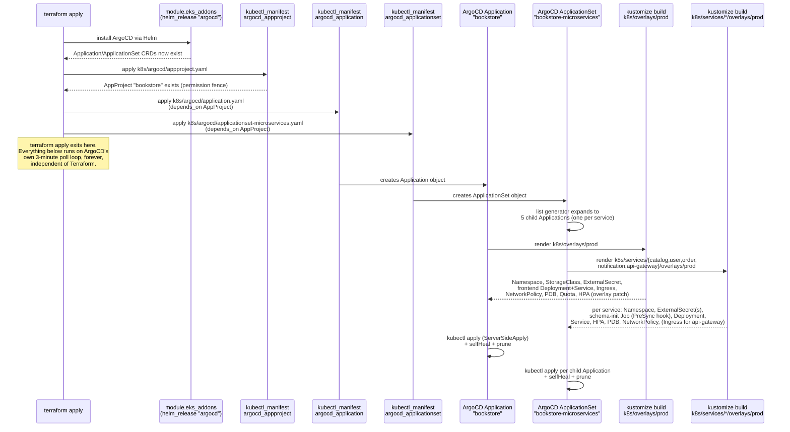

# The `k8s/` Folder, Explained So You Can Teach It

Before the folder structure: two Kubernetes ideas that everything else in this file assumes you already have straight.

**A Kubernetes manifest is just a YAML file describing a desired object** — "I want a Deployment named `catalog-service`, running this image, with these resource limits." You don't tell Kubernetes *how* to make that true, you describe the end state, and a set of controllers inside the cluster continuously work to make reality match. This is the same declarative idea as Terraform, one layer up the stack: Terraform declares AWS resources exist; Kubernetes manifests declare *application* resources exist, inside infrastructure Terraform already built.

**A namespace is a wall inside the cluster, not a different cluster.** Kubernetes runs one shared pool of servers (the EKS node group), but namespaces let you partition that shared pool into isolated zones — separate names, separate default network rules, separate resource quotas — without needing 6 separate clusters. This project has 6 real application namespaces (`bookstore`, `catalog`, `user`, `order`, `notification`, `gateway`), one per deployable thing, plus several more created by Helm for cluster add-ons (`argocd`, `argo-rollouts`, `external-secrets`; the AWS Load Balancer Controller lives in the pre-existing `kube-system` namespace rather than its own).

---

## Part 0: Kubernetes, explained with zero jargon, for someone who's never touched a computer's insides

Picture a shipping port. Cargo doesn't travel loose — it goes inside standardized shipping containers, all the same shape, that any crane, any ship, any truck knows how to pick up and move, regardless of what's actually packed inside any specific one. You don't care *how* the container was loaded; you just care that it is what the label says it is, and that it shows up where it's supposed to.

**A "container" in software is the same idea.** It's a packaged, self-contained bundle of one piece of software plus everything it needs to actually run — nothing about the computer underneath needs to be specially prepared for it. That's what `catalog-service`, `user-service`, and every other piece of this application actually are: containers. This project builds one for each of the 5 backend services and the frontend.

**Now picture the port's harbor master.** Ships (physical or virtual servers) arrive and leave. Hundreds of containers need to be placed somewhere sensible, and if a container falls overboard or gets damaged, someone needs to notice and get a replacement out immediately, without a human having to watch the docks 24 hours a day. If a rush of extra cargo shows up, more containers of the popular item need to appear fast. And customers calling in to ask "where's my package" need one phone number to call — they shouldn't need to know which specific ship their container happens to be sitting on right now, that could change at any moment.

**Kubernetes is that harbor master, for software containers running across a group of servers instead of ships.** It decides which server runs which container, restarts a container automatically if it crashes, spreads copies of busy services across multiple servers so one server dying doesn't take everything down, and gives every service a stable "phone number" so other services can find it no matter which physical server it's currently running on.

**A few words that will come up constantly, translated once, plainly, building on the port analogy:**

- **"Node"** — one physical or virtual server, one ship in the harbor. This project has 3 of them (all the same size, `t3.medium`), plus one separate small server that isn't part of the Kubernetes harbor at all, used only for monitoring.
- **"Pod"** — the actual shipping container: the smallest thing Kubernetes places and moves, almost always exactly one running copy of one application. When people say "restart the pod," they mean "throw away this specific container and place a fresh, identical one."
- **"Cluster"** — the whole port: every node, managed together as one system, by one harbor master.
- **"Namespace"** — a section of the port reserved for one department, so `catalog`'s containers and `user`'s containers don't get mixed up, listed together, or accidentally allowed to talk to each other unless someone explicitly opens a gate between the two sections. This project has one namespace per service.
- **"Deployment"** — a standing order given to the harbor master: "always keep exactly 2 copies of this container running; if one is damaged, replace it; if I update the design, swap them out for the new version without ever having zero copies running at once." You don't personally place containers — you write the standing order, and Kubernetes continuously makes reality match it.
- **"Service"** — the one phone number customers call. Behind the scenes, a Service automatically routes each call to whichever copy of the container currently happens to be healthy and running, on whichever node it happens to be on right now — the caller never needs to know or care.
- **"YAML file"** — the actual paperwork. Every concept above (a Deployment, a Service, a Namespace) is written down as a YAML file — a plain text document listing properties, like a filled-out order form. Kubernetes reads these forms and makes reality match what's written on them, the same declarative idea as Terraform's blueprint, one layer further inside — Terraform built the port itself (the servers, the network); Kubernetes decides what runs on it.

One more idea worth having before the file-by-file walkthrough: **a Kubernetes manifest is just a YAML file describing a desired object** — "I want a Deployment named `catalog-service`, running this container, with these resource limits." You don't tell Kubernetes *how*, you describe the end state, and a set of controllers inside the cluster continuously work to make reality match. That's the harbor master constantly checking the standing orders against what's actually docked, every few seconds, forever — not a one-time instruction that's forgotten the moment it's carried out.

---

## Part 1: Why the folder is organized the way it is — the "base + overlay" pattern

This is the single most important structural idea in the whole `k8s/` tree, and it's worth being able to explain from first principles, not just point at.

**The problem it solves:** you want the *same* application definition — same container, same ports, same health checks — to run slightly differently in different contexts. Maybe production runs 2 replicas of the frontend and local development runs 1. Maybe the image tag is different per environment. Without a mechanism for this, you'd end up maintaining two nearly-identical, hand-copied sets of YAML files, and the moment someone updates one and forgets the other, they silently drift apart — a classic, common source of "it worked in dev, why doesn't it work in prod" bugs.

**The tool: Kustomize**, a templating-free way of layering changes on top of a shared foundation, built directly into `kubectl` (no separate tool to install). The pattern has two kinds of folders:

- **`base/`** — the real, complete, honest definition of a thing. Every service has its own `base/` folder (`k8s/services/catalog-service/base/`, etc.), and there's a shared one at `k8s/base/` for the frontend/monolith-remnant pieces. A `base/` is never deployed directly by itself in this project — it's the shared foundation every environment builds on.
- **`overlays/<environment>/`** — a small `kustomization.yaml` that says "start from that base, and apply these specific, targeted changes" — patch a replica count, swap an image tag, nothing more. Overlays are deliberately tiny; if an overlay starts getting big, that's a sign something that should be common got duplicated instead.

**Why this instead of, say, separate copy-pasted folders per environment, or a full templating language like Helm for every service?** Kustomize's specific selling point is that a `base/` is *plain, valid Kubernetes YAML* — you can `kubectl apply -f base/` directly and it works, no templating syntax, no `{{ }}` placeholders to squint at. Overlays are pure, explicit patches (JSON-patch style operations: "replace this exact field at this exact path with this exact value") — reading an overlay tells you *exactly* what's different from the base, nothing hidden in a templating engine's logic. For a project this size — small, well-understood services, not hundreds of tunable parameters — that transparency is worth more than Helm's extra power.

**A concrete example, worth walking through out loud:** `k8s/services/catalog-service/base/kustomization.yaml` lists 11 real files (namespace, limitrange, configmap, external-secret, admin-db-secret, schema-init-job, deployment, service, hpa, pdb, network-policy) — that's the complete, real definition of the catalog service. `k8s/services/catalog-service/overlays/prod/kustomization.yaml` is four lines: "use that base, and set the container image to this exact ECR URL and tag." That's the entire environment-specific difference. Nothing about the deployment's replica count, resource limits, or health checks is duplicated or re-specified — prod gets 100% of the base, plus one small patch.

**Who actually decides that image tag, and how does it get there?** This is the GitOps loop from the Architecture doc, made concrete: CI (GitHub Actions) runs `kustomize edit set image` against exactly this file after a successful build, commits the change, and pushes it. The placeholder `000000000000` (a fake AWS account ID) sitting in these files in git is intentional — real deploys always have this value overwritten by CI before ArgoCD ever reads it; a human doing a one-off manual deploy is expected to substitute their own real account ID by hand.

### Why is there a separate `k8s/services/*/` tree per microservice, instead of one shared `k8s/base/`?

Because each microservice is an independently deployable unit with its own namespace, its own database credentials, its own scaling behavior — genuinely separate applications that happen to live in the same git repository. `k8s/base/` (no `services/` in the path) is specifically the **older, original frontend/monolith** definition, predating the microservices split — it's not "the shared base for everything," it's just one more application's base, the oldest one. Structuring it this way — every deployable thing gets its own `base/` + `overlays/` pair, all siblings under either `k8s/base/` or `k8s/services/<name>/` — means adding a 6th microservice later is exactly "add a new sibling folder with the same 11-file pattern," not "modify a shared folder everyone else also depends on."

### Why does ArgoCD point at `k8s/services/*/overlays/prod` and not the `base/` folders directly?

Because the overlay is where the *real, final* configuration lives — the base alone still has the placeholder account ID and no real image tag. ArgoCD's `ApplicationSet` (`k8s/argocd/applicationset-microservices.yaml`) has one entry per microservice, each pointing at that service's `overlays/prod` path — when ArgoCD syncs, it effectively runs `kustomize build` on that overlay path, which produces the fully-resolved, base-plus-patches YAML, and applies *that*.

---

## Part 2: One service, file by file — the pattern every microservice repeats

Rather than explain 4 nearly-identical services 4 times, learn `catalog-service`'s `base/` folder completely — `user-service`, `order-service`, and `notification-service` are the same 11-file shape with different names, database schemas, and (for `notification-service`) no external calls out. `api-gateway` is the one real structural exception, covered separately below.

### `namespace.yaml`

```yaml
apiVersion: v1
kind: Namespace
metadata:
  name: catalog
  labels:
    pod-security.kubernetes.io/enforce: restricted
    pod-security.kubernetes.io/audit: restricted
    pod-security.kubernetes.io/warn: restricted
```

Creates the namespace itself, and — the important part — three labels that turn on **Pod Security Admission** at the `restricted` level, Kubernetes' built-in, no-extra-software-needed security gate. `enforce` actually blocks any pod that violates the policy from being created at all; `audit` and `warn` log/flag violations without blocking (useful during a transition period, less relevant here since enforce is already on). "Restricted" is the strictest of Kubernetes' three built-in levels — it requires, among other things, that a pod not run as root, not allow privilege escalation, and drop all Linux capabilities by default. Every single Deployment and Job in this project is written to comply with this from the start (see `deployment.yaml` below) — this label is what makes that compliance *mandatory*, not just a convention someone could quietly stop following.

### `limitrange.yaml`

A safety net, not a fix for an active problem — every container in this project already sets its own explicit CPU/memory requests and limits (see `deployment.yaml`), so this exists purely to catch the case where someone adds a *new* container later and forgets to. Without it, a forgotten container would have zero resource requests, meaning Kubernetes has no idea how much of a node it needs and can schedule it anywhere, potentially starving its neighbors.

### `configmap.yaml`

Non-secret configuration — things like `DB_PORT`, `DB_NAME`, `APP_PORT` — plain values that are fine to see in git, injected into the container as environment variables. The line "why is this not a Secret" is worth having an answer for: a `ConfigMap` and a `Secret` are functionally almost identical (both become env vars or mounted files), the only real Kubernetes-level difference is that Secret *values* are base64-encoded (not encrypted — base64 is trivially reversible, it's encoding, not security) and Kubernetes' API and tooling treat Secrets with slightly more care (e.g., not printed in `kubectl describe` output by default). The real distinction this project draws is intent: does this value need to stay out of git? A port number doesn't. A database password does.

### `external-secret.yaml`

The bridge from AWS Secrets Manager into a real, native Kubernetes Secret — covered in depth in the Architecture doc's secrets section. The one detail worth calling out specifically here: the `argocd.argoproj.io/hook: PreSync` and `sync-wave: "-1"` annotations. **A "hook" tells ArgoCD "apply this resource in a special, ordered phase, separate from the normal sync"**, and **"sync-wave" is the ordering number within that phase** — lower numbers go first. This ExternalSecret is marked to run *before* the normal deployment resources, at wave -1, specifically because the `schema-init-job.yaml` in this same folder (also a PreSync hook, at the default wave 0) needs the database credentials this ExternalSecret produces to already exist by the time it starts. Get the wave number wrong, or forget the hook annotation entirely, and you get a real, previously-hit failure mode: the Job starts, tries to read a Secret that doesn't exist yet, and fails repeatedly until someone notices.

### `admin-db-secret.yaml`

A second `ExternalSecret`, pulling the *admin* database credentials (not this service's own scoped credentials) into this namespace specifically so `schema-init-job.yaml` can use them to create the database and the service's own least-privilege user. Worth naming why this doesn't need any new AWS permission: the cluster's `ClusterSecretStore` is already scoped to all of `/bookstore/*` in Secrets Manager, so pulling a second secret under that same path tree is free — no new IAM policy required, just a new `ExternalSecret` object.

### `schema-init-job.yaml`

A Kubernetes `Job` (a pod that runs once, to completion, rather than staying up like a Deployment), also a PreSync hook, that connects to the shared RDS instance with the *admin* credentials and runs idempotent SQL: `CREATE DATABASE IF NOT EXISTS`, `CREATE TABLE IF NOT EXISTS`, `CREATE USER IF NOT EXISTS`, ending with a narrow `GRANT SELECT, INSERT, UPDATE, DELETE` (deliberately *not* `GRANT ALL PRIVILEGES`, which used to be the case — a real least-privilege fix; the schema-init Job needs admin rights to *create* things, but the app's day-to-day credentials only ever need to read and write rows, never alter table structure or manage other users) — for exactly this one service's schema. **"Idempotent" is the key word to be able to define on the spot:** every statement is written so running it a second, third, or hundredth time produces the exact same end state as running it once, with no error and no duplicate side effect. That property is what makes it safe for this Job to genuinely re-run on *every single ArgoCD sync*, not just the first one ever — which is exactly what happens, since nothing in ArgoCD's normal sync behavior "remembers" that a hook already ran successfully once, long ago.

`hook-delete-policy: BeforeHookCreation,HookSucceeded` is worth being able to explain precisely: `HookSucceeded` alone means "delete this Job after it finishes successfully" — but a Job that *fails* would then be left behind forever, un-deleted, and every future sync attempt would collide with that same-named, permanently-broken Job instead of getting a fresh try. `BeforeHookCreation` closes that gap: delete whatever hook resource existed before, success or failure, right before creating the new one — guaranteeing every sync gets a genuinely fresh attempt.

### `deployment.yaml`

The actual running application. Worth reading top to bottom as a checklist of security and reliability practices, because nearly every line here answers a "why is this here" question on its own:

- **`replicas: 1`** — this service runs a single copy. Combined with `pdb.yaml`'s `maxUnavailable` (not `minAvailable`) below, that's a deliberate, coordinated pair of decisions, not an oversight.
- **`automountServiceAccountToken: false`** — by default, every pod gets a token mounted automatically that lets it talk to the Kubernetes API as itself. This service never calls the Kubernetes API for anything, so that default token is pure unnecessary exposure — explicitly turned off.
- **`securityContext` at the pod level** (`runAsNonRoot`, a specific non-zero UID/GID, `seccompProfile: RuntimeDefault`) — enforces the container never runs as root and uses the kernel's default, restrictive syscall filter.
- **`securityContext` at the container level** (`allowPrivilegeEscalation: false`, `readOnlyRootFilesystem: true`, `capabilities: drop: ["ALL"]`) — the container's own filesystem is read-only (which is *why* a `tmp` `emptyDir` volume is separately mounted at `/tmp` — Node.js and many libraries need to write *somewhere*, and this gives them exactly one narrow, non-persistent place to do it, without needing to relax the read-only root filesystem itself), and it starts with zero Linux capabilities, adding back only what's explicitly needed (nothing, here).
- **`resources.requests`/`limits`** — CPU and memory, explicit on every container, which is what makes Kubernetes' scheduling and the LimitRange backstop both meaningful.
- **`readinessProbe`/`livenessProbe`** — two different questions, worth being crisp about the distinction: *readiness* asks "should traffic be sent to this pod right now" (a pod can be alive but temporarily not ready, e.g. still warming up — it gets removed from the Service's routing until it passes); *liveness* asks "is this pod fundamentally broken and needs to be killed and restarted" (a hung process that never responds gets killed even if it never technically crashed). Both hit the same `/health` endpoint here, but they serve genuinely different purposes and have different consequences when they fail.
- **The `prometheus.io/scrape` annotations** — not a Kubernetes-native concept at all, just a convention the monitoring EC2's Prometheus is specifically configured to look for (via its `file_sd_configs` target discovery), telling it "yes, scrape this pod's `/metrics` on this port."

### `service.yaml`

A `Service` is a stable network name and address for a set of pods, selected by label (`app: catalog-service`), that load-balances across however many replicas currently exist and match. `type: ClusterIP` (the default) means this address is only reachable *from inside the cluster* — there is no path from the public internet directly to this Service, which is exactly the intended design: only `api-gateway` (and, for other services, the ingress controller) is ever meant to reach it.

### `hpa.yaml`

The HorizontalPodAutoscaler — watches this Deployment's actual CPU/memory usage against the requests declared in `deployment.yaml` (utilization is always a percentage *of the request*, not an absolute number — worth knowing precisely, since it's a common point of confusion), and adds or removes replicas to keep both under 70%/80% respectively, within a `minReplicas`/`maxReplicas` band. This entire mechanism was silently non-functional for a real stretch of this project's history — every HPA showed `<unknown>` for its current metrics and never actually scaled anything, because nothing in the cluster was running the `metrics-server` that HPAs depend on to know current usage at all. Fixed by adding `metrics-server` as a managed EKS addon (see the Terraform doc).

### `pdb.yaml`

The PodDisruptionBudget — a promise to Kubernetes about how much *voluntary* disruption (a node drain, a cluster upgrade, an autoscaler consolidating nodes) this service can tolerate at once. This file is the single best "walk me through a real bug you understand" example in the whole project: it deliberately uses `maxUnavailable: 1`, not `minAvailable: 1`, and the comment in the file explains exactly why — with `replicas: 1` and a `minAvailable: 1` PDB, Kubernetes' own math says "at least 1 must remain available at all times," which for a service with exactly 1 replica total means **zero voluntary evictions are ever allowed, permanently** — a `kubectl drain` or a node upgrade touching that one pod would simply hang forever, waiting for a condition that can structurally never be satisfied. `maxUnavailable: 1` asks a different, satisfiable question — "at most 1 may become unavailable at once" — which for a 1-replica service correctly allows exactly the one eviction needed to move it, while still creating a real PDB object that would still meaningfully protect a service running more replicas. The general rule worth stating plainly: **for a single-replica workload, use `maxUnavailable`, never `minAvailable`** — this exact mistake was found and fixed across 4 different services in one pass, and independently found *again*, later, in the ingress-nginx controller's own PDB (configured via Terraform/Helm, not a `k8s/` YAML file, which is exactly why it was missed the first time). Worth knowing that ingress-nginx itself is gone now, replaced by the AWS Load Balancer Controller (see the Architecture doc) — but the *rule* this bug taught isn't tied to that specific controller; it applies to any single-replica workload with a PDB, forever.

### `network-policy.yaml`

Two objects, always the same shape across every service: a `default-deny-all` (blocking *all* ingress and egress for every pod in the namespace, the "closed by default" foundation) and one specific, narrow allow policy for this service's own pods. Catalog's allow rule: accept ingress only from pods in the `gateway` namespace, on port 3000; allow egress only to the database's CIDR range on port 3306, plus DNS (port 53, both UDP and TCP — DNS resolution needs both, and it's easy to forget one and get mysterious intermittent failures).

**One pair of these files is worth reading together, because they're the network-layer proof of the checkout flow's fire-and-forget call (see the Architecture doc's checkout walkthrough):** `order-service`'s NetworkPolicy has a *third* egress rule beyond the database and DNS ones every other service has — explicit permission to reach the `notification` namespace on port 3000. `notification-service`'s NetworkPolicy, symmetrically, only accepts *ingress* from the `order` namespace, on the same port, and from nowhere else — not from `gateway`, not from any other service. That pairing is the NetworkPolicy layer independently enforcing the exact same one-directional relationship the application code implements (order calls notification; nothing else ever does, and notification never calls anyone back) — even if a bug in `api-gateway` somehow tried to route a request straight to `notification-service`, the network layer would refuse it before the request ever arrived, regardless of what the application code thought it was doing.

**The single sharpest, most instructive bug to know from this file's history**, seen in `api-gateway`'s version of this same file: NetworkPolicy egress rules match against the pod's actual `containerPort` (3000 here) — **not** the Service's externally-visible port (80). An earlier version of the gateway's egress rule used port 80, matching the Service's port instead of the real destination port traffic actually arrives on after Kubernetes' internal load-balancing (`kube-proxy`) rewrites the connection — and that mismatch would have **silently blocked every single request from the gateway to any backend service**, the instant NetworkPolicy enforcement was ever turned on in the CNI. It never actually broke production, because it was caught in review before the CNI's enforcement flag was flipped on — but it's the textbook example of why "which port does a NetworkPolicy actually match against" is a real, sharp, non-obvious detail worth knowing cold, not glossing over.

---

## Part 3: `api-gateway` — the one service shaped differently, and why

`api-gateway`'s `base/` folder has the same core shape (namespace, limitrange, configmap, deployment, service, hpa, pdb, network-policy) but two real, structural differences worth naming:

1. **No `schema-init-job.yaml` or `admin-db-secret.yaml`** — because `api-gateway` has no database of its own. It's a pure reverse proxy; it holds no state and owns no schema.
2. **It has its own `ingress.yaml`**, where every other backend microservice has none. This is deliberate and important: `api-gateway` is the *only* backend service meant to be reachable from outside the cluster at all — an `Ingress` object is what actually tells the NGINX Ingress Controller "route requests for this hostname to this Service." Its host, `api.bookstore.<domain>`, is entirely separate from the frontend's own `Ingress` (`k8s/base/ingress/ingress.yaml`, host `bookstore.<domain>`) — two different hostnames, routed by the same shared ingress controller to two completely different backend Services. There used to be a real bug here worth knowing: the frontend's `Ingress` *also* briefly had a rule for the `api.bookstore.<domain>` host (left over from before the gateway existed), meaning **two different `Ingress` objects claimed the same hostname** — undefined, confusing behavior in NGINX ingress (whichever object NGINX happened to merge rules from "won," inconsistently). Fixed by removing that stale rule entirely from the frontend's `Ingress`, leaving `api-gateway`'s own `Ingress` as the sole, unambiguous owner of that hostname.

Its `deployment.yaml` also runs `replicas: 2` (not 1) from the base itself, no overlay patch needed — a deliberate acknowledgment that this is the one component every single request passes through, so it never should have been a single-replica service to begin with. Its NetworkPolicy egress rules are the ones with the port-80-vs-3000 story above; its ingress rule accepts traffic by VPC CIDR (`ipBlock`, not `namespaceSelector`) rather than from any specific namespace — the ALB (see the Architecture doc's Elastic Load Balancing section) connects straight to this pod's real IP from its own network interfaces in the VPC, not from a pod in any namespace at all, which is a hard requirement for `target-type: ip` mode, not a stylistic choice.

---

## Part 4: `k8s/base/` — the original frontend, and what's genuinely dead code

`k8s/base/` predates the microservices split and today holds just the **frontend** (a static React build served by a small web server) plus a handful of cluster-wide, shared concerns:

- **`storageclass/gp3.yaml`** — declares gp3 as the cluster's *default* `StorageClass`, so anything that asks Kubernetes for persistent storage without specifying a type gets modern, cost-efficient gp3 EBS volumes automatically, not the older gp2 default.
- **`secrets/external-secret.yaml`** — specifically the `ClusterSecretStore` itself, the cluster-wide connector every other namespace's `ExternalSecret` objects reference by name. This is why it lives here and not inside any one service's folder: deleting it would break every microservice's secret syncing, not just the frontend's.
- **`frontend/`, `ingress/`, `network-policy/`, `pdb/`, `quota.yaml`** — the frontend's own version of the same per-service pattern covered in Part 2, plus a namespace-wide `ResourceQuota` (a hard ceiling on total CPU/memory/pod-count across the whole `bookstore` namespace, one level above the per-container LimitRange).
- **`monitoring/servicemonitor.yaml` and `prometheus-rules.yaml`** — genuinely inert. They're `monitoring.coreos.com/v1` custom resources meant to be consumed by the Prometheus Operator, which this cluster does not run (Prometheus lives on the standalone EC2, scraping via static file-based configuration instead — see the Architecture doc). Kustomize's `kustomization.yaml` deliberately does **not** include these two files in its `resources:` list, with a comment explaining exactly why: applying an object of a `kind` the cluster's API doesn't recognize doesn't just silently no-op that one object, it fails the *entire* ArgoCD sync batch — a real, previously-hit incident, not theoretical caution.

**What used to be here and is now gone entirely:** an in-cluster MySQL `StatefulSet`, `Service`, and its schema-init `ConfigMap` — an artifact of the project's very earliest design, before RDS was adopted as the real, only database. These files sat on disk, never referenced by any `kustomization.yaml`, for a long time — genuinely inert, but a real risk in a different sense: a future contributor skimming the folder structure could easily assume in-cluster MySQL was a supported, working path, and manually `kubectl apply` it, standing up a second, empty, entirely disconnected database nobody's application actually talks to. They were deleted outright once confirmed unreferenced, rather than left as a trap.

**Also gone: `cert-manager/cluster-issuer.yaml`** — used to hold the `ClusterIssuer` object telling cert-manager how to get real TLS certificates (Let's Encrypt's production ACME endpoint, HTTP-01 challenge). Removed alongside cert-manager itself once ingress-nginx was retired (see the Architecture doc's Elastic Load Balancing section) — TLS moved to an ACM certificate the AWS Load Balancer Controller auto-discovers by hostname, and cert-manager had no other consumer in this project once that one went away. Unlike the MySQL files above, this one wasn't dead code sitting unused — it was live, load-bearing infrastructure right up until the moment its one consumer was intentionally replaced.

---

## Part 5: The overlays, and what "prod" versus "dev" actually means here

`k8s/overlays/prod/kustomization.yaml` (for the frontend) does two small, real things on top of `base/`: sets the real ECR image reference, and patches the `ClusterIssuer`'s email address (a small operator-specific value that doesn't belong hardcoded in the shared base). It also pulls in `hpa-frontend.yaml` — the frontend's HorizontalPodAutoscaler lives *only* in the prod overlay, not the base, a deliberate signal that auto-scaling is a production concern, not something you'd necessarily want fighting you during local development.

`k8s/overlays/dev/kustomization.yaml` is the clearest possible illustration of the whole pattern's point: it is **four lines long**, and its entire job is one JSON-patch operation — take the base, and override the frontend Deployment's `replicas` from 2 down to 1. Nothing else about the application changes. That's what a well-designed overlay looks like: a complete, deployable environment, expressed as the smallest possible diff from a shared, honest foundation.

---

## Part 6: `k8s/argocd/` and `k8s/secrets/` — the two folders that aren't "an application"

**`k8s/argocd/`** holds the ArgoCD configuration objects themselves — `appproject.yaml`, `application.yaml`, and `applicationset-microservices.yaml`. These are applied by Terraform's `argocd.tf`, not `kubectl apply`'d by a human — but they remain plain YAML here specifically so they stay readable, reviewable, and identical to what ArgoCD itself later reads from git on every sync. Worth reading these three field-by-field, since they're the exact object that decides what ArgoCD is allowed to do and how:

**`appproject.yaml`** is the permission boundary all the others operate inside — think of it as the fence around the whole platform. `sourceRepos` lists exactly one git URL: nothing else can be pulled from, ever, no matter what an `Application` inside this project claims. `destinations` lists exactly the 6 real namespaces this platform deploys into, each paired with `server: https://kubernetes.default.svc` — that oddly-specific value is Kubernetes' own internal, in-cluster DNS name for "the API server of the cluster this pod is currently running in" (ArgoCD only ever manages this one cluster, so every destination uses the same server value, differing only by namespace). `clusterResourceWhitelist` is deliberately narrow — `Namespace`, `StorageClass`, and `ClusterSecretStore`, nothing more — which is a real, meaningful lockdown: without any whitelist entry at all here, ArgoCD refuses to manage *any* cluster-scoped resource. `namespaceResourceWhitelist: {group: "*", kind: "*"}` is comparatively permissive — but bounded entirely by the `destinations` list above it, so "anything goes" only inside the 6 approved namespaces, nowhere else. Before this file existed, both Applications ran under ArgoCD's built-in `default` AppProject, which enforces none of these boundaries at all — any repo, any namespace, any cluster-scoped kind.

Worth knowing the whitelist only ended up with all three kinds after a real bug, not by getting it right on the first try: it originally listed just `Namespace`, on the stated assumption that Namespace was the only cluster-scoped kind any of these apps create. Wrong — `k8s/base/storageclass/gp3.yaml` is a `StorageClass`, and every service's `external-secret.yaml` points at a `ClusterSecretStore`, both genuinely cluster-scoped. This stayed invisible on a long-lived cluster, where those two resources already existed and ArgoCD never needed to *create* them fresh — it only surfaced, as `resource external-secrets.io:ClusterSecretStore is not permitted in project bookstore` and the equivalent for `StorageClass`, the first time this project's cluster came up completely from scratch and ArgoCD actually had to create everything, including those two, from nothing.

**`application.yaml`** is one ArgoCD `Application` — the frontend. Field by field: `finalizers: [resources-finalizer.argocd.argoproj.io]` means "when this Application object itself is deleted, first cascade-delete every Kubernetes resource it manages" — without it, deleting the `Application` would just make ArgoCD stop *watching* those resources, leaving them running, orphaned, forever. `source.targetRevision: observability` pins ArgoCD to one specific git branch — worth noting the code comment's own honesty about this being a temporary, deliberate override tied to where active development is happening, not a permanent choice. `source.kustomize: {}` (empty block, not omitted) is what tells ArgoCD "render this path by running Kustomize on it," as opposed to treating it as plain, un-templated YAML. `destination.namespace: bookstore` sets the *default* namespace for any resource in the rendered output that doesn't specify its own — most objects here do specify `bookstore` explicitly anyway, but this is the fallback. `syncPolicy.automated.prune: true` means resources removed from git get deleted from the cluster automatically on the next sync — without `prune`, ArgoCD would only ever *add* things, and a deleted YAML file would leave its Kubernetes object behind forever, orphaned in the same way as a missing finalizer, just at the individual-resource level instead of the whole-Application level. `selfHeal: true` is the live-reconciliation behavior repeated throughout this doc — a manual `kubectl edit` on anything this Application owns gets silently reverted on the next 3-minute poll. `syncOptions: [CreateNamespace=true, ServerSideApply=true]` — the first lets ArgoCD create the target namespace itself if it doesn't exist yet (rather than failing because "namespace not found"); the second switches from the older client-side apply mechanism (which computes a diff locally and can conflict awkwardly when multiple controllers touch the same object) to the Kubernetes API server's own native server-side apply mechanism, which handles field ownership and merge conflicts more correctly, especially relevant since the HPA controller, for instance, actively mutates `spec.replicas` on the same Deployment ArgoCD also manages — server-side apply is what lets both of those touch the same field without fighting each other on every sync. `retry.limit: 5` with `backoff` (5 seconds, doubling each attempt — `factor: 2` — capped at 3 minutes) means a failed sync doesn't just give up after one try, and doesn't hammer a struggling cluster with 5 attempts in the same second either.

**`applicationset-microservices.yaml`** generates 5 `Application` objects from one template, using a `list` generator — the simplest of ArgoCD's several generator types, just a literal, hand-maintained list of `{service, namespace}` pairs. Everything under `template:` is the same shape as `application.yaml` above, but with `{{service}}` and `{{namespace}}` placeholders that ArgoCD substitutes once per list element — `'{{service}}'` becomes the `Application`'s own name, `'k8s/services/{{service}}/overlays/prod'` becomes its source path, `'{{namespace}}'` becomes its destination. Adding a 6th microservice later is exactly one new 2-line entry in the `elements` list — no new file, no copy-pasted `Application` YAML to keep in sync with the other five.

**`k8s/secrets/db-secret.yaml`** is the odd one out, and its own file header says so directly: a plaintext-placeholder Kubernetes `Secret`, meant *only* for local development without AWS access, explicitly never meant to be applied in production and explicitly gitignored the moment anyone fills in real values. It exists purely as a documented escape hatch for local iteration — real deployments never touch it, they use `k8s/base/secrets/external-secret.yaml`'s `ClusterSecretStore` path instead.

---

## Part 7: The mechanics, precisely — no doubts left

Everything above explained *what* each file does and *why* it's shaped that way. This part is the actual internal machinery underneath the words "Service," "NetworkPolicy," "HPA," and "PDB" — so a follow-up "okay but *how* does that actually work" has a real, specific answer.

### How a Service actually routes traffic — kube-proxy and Endpoints, not magic

A `Service` object itself is just a stable name and a virtual IP address — it does no routing on its own. The real work is done by **`kube-proxy`**, a process running on every node, which continuously watches the API server for two things: the Service's definition, and a separate, auto-maintained object called an **`Endpoints`** (or `EndpointSlice`) list — the actual current set of pod IPs that match the Service's label selector *and* are currently passing their readiness probe. Every time a pod becomes ready or stops being ready, that Endpoints list updates, and kube-proxy reprograms the node's networking rules (on EKS, typically Linux `iptables` or `IPVS` rules) so that any traffic sent to the Service's virtual IP gets transparently rewritten (destination NAT) to one of the currently-healthy real pod IPs, chosen essentially at random per new connection. This is also the exact mechanical reason NetworkPolicy egress rules match against the pod's real `containerPort`, not the Service's port (the sharp bug covered above): by the time a packet has been through this DNAT rewrite, its destination is already the pod's real address and real port — the Service's port number was only ever relevant for the first hop, addressing the virtual IP.

### How NetworkPolicy enforcement actually happens — it's not the Service, it's the CNI

A `NetworkPolicy` object, by itself, is inert — Kubernetes' API happily stores it whether or not anything is watching for it. Enforcement is entirely the job of the **CNI (Container Network Interface) plugin** — the piece of software actually responsible for wiring up pod networking on each node. This project uses the **AWS VPC CNI**, and specifically relies on its built-in network-policy agent (turned on via the `ENABLE_NETWORK_POLICY=true` addon configuration covered in the Terraform doc) — without that one setting, every NetworkPolicy object in this entire `k8s/` tree is simply never consulted by anything, ever, and traffic flows exactly as if none of them existed. Once enabled, the agent on each node maintains a live set of eBPF (or iptables, depending on version) rules per pod, built directly from the NetworkPolicy objects whose `podSelector` matches that pod, and evaluates every packet in and out against those rules before it's allowed to leave or enter the pod's network namespace. This is why "the NetworkPolicy YAML exists" and "the NetworkPolicy is actually enforced" are two genuinely separate facts, and why this project's docs are careful to call that distinction out explicitly rather than assume one implies the other.

### The HPA control loop — the actual formula, not just "it scales up"

The HorizontalPodAutoscaler controller runs on a fixed interval (roughly every 15 seconds by default) and, each time, does the same calculation for every HPA object: it asks the metrics API (served by `metrics-server`, the addon covered in the Terraform doc) for the current average resource utilization across all matching pods, then computes:

```
desiredReplicas = ceil( currentReplicas × ( currentMetricValue / desiredMetricValue ) )
```

For `catalog-service-hpa`: if 1 replica is currently running at 140% of its CPU *request* (not an absolute number — always a percentage of what the container asked for in `resources.requests`), the math is `ceil(1 × (140/70)) = 2` — it doubles to 2 replicas, then re-evaluates from there on the next tick. When multiple metrics are configured (this project checks both CPU and memory), the HPA computes a desired count for *each* independently and takes the **larger** of the two — meaning either metric alone can trigger scale-up, but both must agree the load has dropped before scaling back down. The whole calculation is capped by `minReplicas`/`maxReplicas` regardless of what the formula says, and Kubernetes also applies a default stabilization window (a few minutes) before scaling back *down*, specifically to avoid rapidly flapping replica count up and down on noisy, borderline metrics.

### The PDB eviction API — what a PodDisruptionBudget actually blocks, and what it doesn't

A PodDisruptionBudget does **not** prevent a pod from being deleted directly — `kubectl delete pod` bypasses it entirely, on purpose, because a PDB is specifically about *voluntary, coordinated* disruptions, not all pod deletion everywhere. What it actually gates is the Kubernetes **Eviction API** — a specific, distinct API endpoint that tools like `kubectl drain`, the Cluster Autoscaler, and EKS's own managed-node-group upgrade process all use instead of a raw delete, precisely *because* it respects PDBs. When something calls the Eviction API for a pod, the API server checks: would evicting this pod violate any PDB whose selector matches it (i.e., would it push the number of *available* matching pods below what the budget allows)? If yes, the eviction request is flatly rejected (not queued, not retried automatically — the caller has to check back later), and the calling tool (say, a node drain) simply waits and keeps retrying until the budget would no longer be violated — which, for the earlier `minAvailable: 1` / `replicas: 1` bug covered above, was a condition that could *never* become true, hanging the drain forever rather than eventually timing out.

### Readiness vs. liveness probes — the exact consequence of each failing, not just "it checks health"

Both probes are run by the **kubelet** (the node-level agent, one per node, responsible for actually starting/stopping/monitoring containers) — not by the Service, not by any central controller. The consequence of failure is where they genuinely diverge: a **readiness** probe failing causes the kubelet to report that pod as not-ready to the API server, which removes it from every matching Service's `Endpoints` list within roughly a second — traffic simply stops being routed there, but the container itself is left running untouched, free to recover on its own and rejoin once it passes again. A **liveness** probe failing after `failureThreshold` consecutive misses causes the kubelet to kill the container outright and restart it fresh, on the same pod, incrementing a visible `RESTARTS` counter — a much more drastic action, reserved for "this process is fundamentally stuck and restarting is the only way out," not "this process is temporarily too busy to answer." This project's specific numbers (`initialDelaySeconds: 10` for readiness vs. `30` for liveness, `periodSeconds: 5` vs. `15`) are a deliberate pattern worth naming: liveness checks are always slower and more patient than readiness checks, because a false-positive readiness failure just costs you one pod briefly out of rotation, while a false-positive liveness failure needlessly kills and restarts a perfectly healthy process — a much more expensive mistake to make by being too trigger-happy.

### IRSA — the full cryptographic trust chain, step by step, not just "it authenticates"

This is the mechanism behind every `serviceAccount.annotations."eks.amazonaws.com/role-arn"` in this project (External Secrets Operator being the concrete example), and it's worth being able to actually draw the chain, not just say "IRSA handles it":

1. When a pod's ServiceAccount carries that specific annotation, EKS's admission webhook automatically injects a **projected volume** into the pod containing a short-lived, cryptographically-signed JWT — signed by the cluster's own OIDC issuer (the same issuer whose thumbprint is registered as an `aws_iam_openid_connect_provider` back in the Terraform doc's `modules/eks` section), unique to that specific ServiceAccount and namespace, and automatically refreshed before it expires.
2. When the application inside the pod calls any AWS SDK method, the SDK (with zero application code changes needed — this is handled by an environment variable and the AWS SDK's own standard credential-resolution chain) reads that JWT file and calls AWS STS's `AssumeRoleWithWebIdentity`, presenting the JWT.
3. AWS STS independently verifies the JWT's signature against the OIDC provider's public key (fetched once, out-of-band, when the provider was registered) — proving the token really was issued by *this specific cluster*, not forged.
4. STS then checks the JWT's claims (specifically, the `sub` claim, something like `system:serviceaccount:external-secrets:external-secrets-sa`) against the target IAM role's trust policy condition — the exact `StringEquals` check visible in `modules/eks-addons/external-secrets.tf`. Only an exact match is accepted; a pod running under any *other* ServiceAccount name, even in the same namespace, gets a flat authorization denial at this step, before AWS even looks at what permissions the role would have granted.
5. If everything matches, STS returns temporary AWS credentials, scoped to exactly that IAM role's policy, expiring automatically — the pod never held a real, long-lived AWS credential at any point in this chain, only a cluster-signed identity token that AWS chose to trust because of a pre-registered, out-of-band relationship.

**The one sentence worth having ready:** *"IRSA lets a specific Kubernetes identity — not a person, not a static key — prove who it is to AWS using a token the cluster itself signs, and AWS independently verifies that signature before handing back credentials scoped to exactly one narrow role, automatically expiring the whole time."*

### The exact reason a `t3.medium` node caps around 17 pods — the ENI IP math

This isn't a Kubernetes limit at all — it's an AWS networking limit that Kubernetes inherits. The VPC CNI gives every pod its own real, routable IP address directly from the VPC's subnet (rather than a separate overlay network, which is what makes pod IPs directly reachable by AWS-native tools like Security Groups and VPC Flow Logs in the first place — a deliberate AWS design choice, not the only way other CNIs do it). Each EC2 instance type has a hard, published limit on how many **Elastic Network Interfaces (ENIs)** it can attach and how many private IP addresses each ENI can hold — for a `t3.medium`, that works out to a maximum number of pod-assignable IPs in the high teens once you subtract the addresses Kubernetes itself reserves per node. Hit that ceiling, and new pods scheduled to that node sit stuck in `Pending` with a networking error — not a CPU or memory shortage, a literal "no IP address left to give this pod" — which is exactly the constraint that drove this project's node-count history (documented across several of the incident references throughout this doc) and is a genuinely different failure mode than the resource-request-based scheduling most people think of first when a pod won't schedule.

---

## Part 8: The full execution order — from `terraform apply` to a running pod, file by file

Two separate control loops hand off to each other exactly once, then run forever independently. Worth being able to draw this from memory: **Terraform creates the *permission* for things to exist; ArgoCD then creates the things**, on its own schedule, forever after — Terraform never touches an application pod directly, not even once.



**Reading it left to right, the way you'd narrate it out loud:**

1. `terraform apply` walks its dependency graph. `module.eks_addons` installs ArgoCD itself via `helm_release` — until this finishes, the `Application`/`ApplicationSet`/`AppProject` Kubernetes CRDs don't exist yet, so nothing downstream can even be validated, let alone created.
2. `argocd.tf`'s three `kubectl_manifest` resources apply the three files under `k8s/argocd/` **as raw YAML, unmodified** (`file()`, not re-expressed in HCL) — `appproject.yaml` first (no dependency beyond ArgoCD itself existing), then `application.yaml` and `applicationset-microservices.yaml`, both of which `depends_on` the AppProject, because ArgoCD's own admission control rejects an `Application`/`ApplicationSet` naming a `project:` that doesn't exist (see OBS-058/059 in `TROUBLESHOOTING.md` for the real outage this ordering fixed).
3. **This is where `terraform apply` actually finishes.** It created two Kubernetes objects (`Application "bookstore"`, `ApplicationSet "bookstore-microservices"`) and one permission object (`AppProject "bookstore"`) — nothing else. It did not create a single application pod, Deployment, or Service. That's ArgoCD's job from here on, running on its own reconcile loop (polls the git repo roughly every 3 minutes, plus reacts to webhooks if configured), completely decoupled from whenever anyone last ran `terraform apply`.
4. ArgoCD's `ApplicationSet` controller expands the `list` generator in `applicationset-microservices.yaml` into 5 real, independent `Application` objects — one each for `catalog-service`, `user-service`, `order-service`, `notification-service`, `api-gateway` — each pointed at its own `k8s/services/<name>/overlays/prod` path.
5. For every `Application` (the frontend's `bookstore` one, plus the 5 generated ones), ArgoCD's repo-server runs `kustomize build` against that `Application`'s `path:`. Kustomize's own resolution is itself layered: `k8s/overlays/prod/kustomization.yaml` says `resources: [../../base]` plus one patch (`hpa-frontend.yaml`) — so it pulls in every resource `k8s/base/kustomization.yaml` lists (`storageclass/gp3.yaml`, `namespace.yaml`, `limitrange.yaml`, `secrets/external-secret.yaml`, `frontend/deployment.yaml`, `frontend/service.yaml`, `ingress/ingress.yaml`, `network-policy/network-policy.yaml`, `pdb/pdb.yaml`, `quota.yaml`) and layers the prod-specific HPA and image tag on top. Each microservice's own `overlays/prod/kustomization.yaml` follows the identical `[../../base]`-plus-image-tag pattern against its own `base/kustomization.yaml` (see Part 2 above for exactly what that base lists, per service).
6. The fully-rendered manifest set — real `Namespace`, `Deployment`, `Service`, `HorizontalPodAutoscaler`, `PodDisruptionBudget`, `NetworkPolicy`, `ExternalSecret`, and (for 4 of the 5 microservices) a schema-init `Job` — gets `kubectl apply`'d with `ServerSideApply=true`, `CreateNamespace=true`. `syncPolicy.automated.selfHeal: true` means any manual `kubectl edit` against a live object gets silently reverted back to match git on the next reconcile; `prune: true` means deleting a resource from git deletes it from the cluster too, not just leaves it orphaned.
7. Only once the `Deployment` objects exist does the kube-scheduler even start looking for pod slots — which is where Part 7's ENI-IP-limit math above actually starts to matter, several steps downstream of anything Terraform or this diagram directly controls.

**The one thing worth internalizing from this whole flow:** re-running `terraform apply` after the very first time touches almost none of this. It's idempotent against the three `k8s/argocd/*.yaml` files (no-op if they haven't changed) and otherwise only manages infrastructure — VPC, EKS, RDS, IAM, the Helm-installed cluster add-ons. Every single app-level change (a new image tag, an edited `Deployment`, a scaled-up `HorizontalPodAutoscaler` max) ships through a `git push` to the manifests under `k8s/`, picked up by ArgoCD's own loop — never through `terraform apply` again. See [`CICD.md`](../docs/CICD.md) for how a `git push` actually reaches that point.

---

## Questions you should be ready for

**"What's the difference between a Deployment and a Job, and why does this project use both?"**
A Deployment describes a long-running thing that should always be up, restarted if it crashes, possibly scaled to multiple replicas — every actual service. A Job runs a task to completion, once (or a bounded number of retries), and then stops — used here exclusively for the schema-init database bootstrap, which should run, succeed, and be done, not stay up forever.

**"How do you know Kustomize actually did the right thing before it's deployed?"**
`kubectl kustomize <path>` (or `kustomize build`) renders the fully-resolved YAML locally, with zero cluster access needed — the exact same output ArgoCD would apply. This project's CI pipeline also runs `kubeconform` against every raw manifest, which validates structural correctness (right fields, right types) against the real Kubernetes API schema before anything ever reaches ArgoCD.

**"Why does ArgoCD poll every 3 minutes instead of being triggered instantly by CI?"**
That's the deliberate GitOps boundary (see the Architecture doc) — CI's responsibility ends at "git now says the new state," and ArgoCD's reconciliation loop is decoupled from CI entirely, on purpose, so the cluster's actual state is always being *continuously* checked against git, not just once, right after a push. A manual `kubectl edit` on something ArgoCD manages gets reverted on the very next poll, not just detected once.

**"What would happen if you deleted the default-deny NetworkPolicy in one namespace?"**
Every pod in that namespace would immediately fall back to Kubernetes' real, unenforced default: fully open ingress and egress, to and from anywhere the cluster's network can reach, constrained only by whatever AWS Security Groups still apply at the node level (a much coarser boundary). It's a genuinely dangerous single deletion, and exactly the kind of thing "defense in depth" (see the Architecture doc) is meant to catch with a second, independent layer even if it happened.

**"Why put resource requests/limits on every single container instead of relying on the namespace-wide ResourceQuota alone?"**
A `ResourceQuota` only caps the *total* across a namespace — it says nothing about how much any *one* pod is allowed to claim. Without per-container limits, one misbehaving pod could consume the entire namespace's quota by itself, starving every other pod that would otherwise fit. The two work at different levels — quota caps the whole neighborhood, requests/limits (and the `LimitRange` backstop) cap each individual tenant — and you need both for either to mean anything.

## Related

- [`ARCHITECTURE_EXPLAINED.md`](ARCHITECTURE_EXPLAINED.md) — the big picture this all runs inside
- [`TERRAFORM_EXPLAINED.md`](TERRAFORM_EXPLAINED.md) — how the cluster and the addons that make this all work (VPC CNI, metrics-server, ArgoCD itself) came to exist in the first place
- [`DOCKER_EXPLAINED.md`](DOCKER_EXPLAINED.md) — the Dockerfiles behind each image, and how their non-root design pairs with these manifests' `securityContext` blocks
- The real docs this was built from: `../docs/KUBERNETES.md`, `../docs/TROUBLESHOOTING.md`, `../docs/UML.md`
